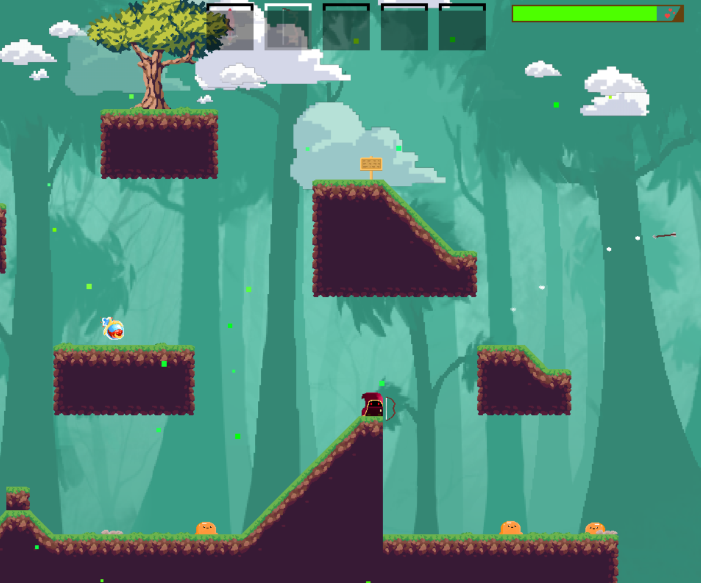

  <h1>RPG Tile Game</h1>
  
  
An RPG tile game, IDK. Made with pygame and hopefully C.

  
  
  
  

## Screenshots

---
## Requirements

This game requires:
- Python 3.7+
- Pygame 2.0+
- Esper
- ModernGL

---
## Installation

1. Download the repo with your favorite method (GitHub Desktop, Git, etc.)
2. CD into the repo
3. Install the required packages with `python -m pip install -r requirements.txt`
4. Run the game with `python main.py`
5. Enjoy!